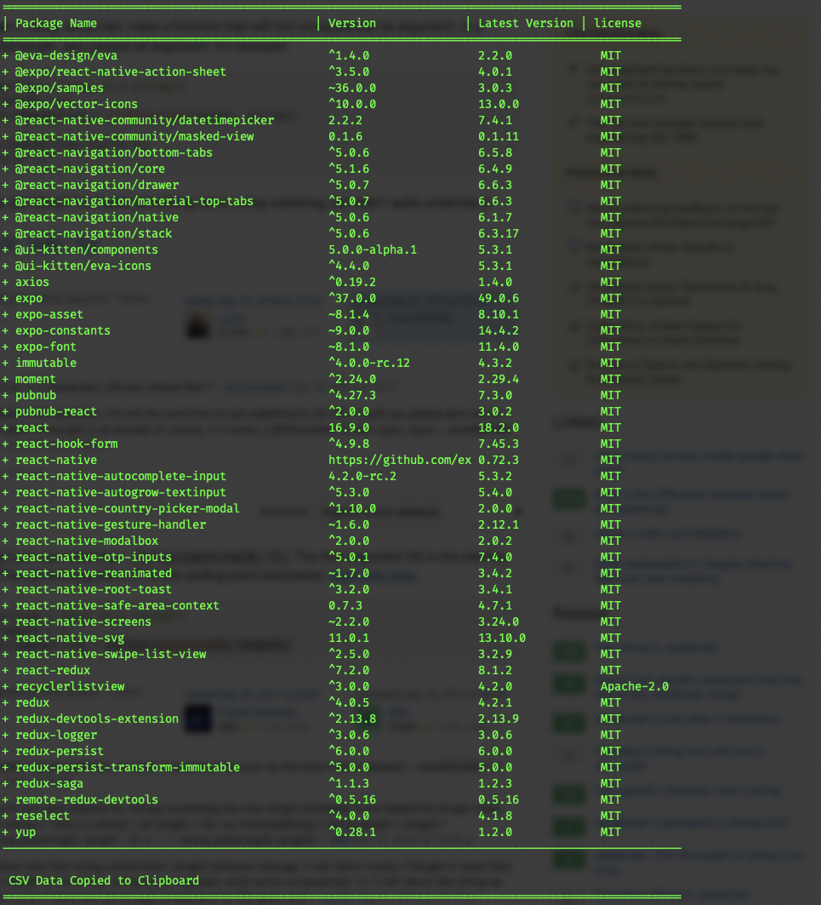

# kings1ay3r/package-auditor
## Package JSON Auditor

This code inspects a `package.json` file given as argument and gives you a report on the packages used. The output is printed on the console and corresponding CSV is copied to the clipboard.
### Installation

run `yarn install` or `npm install`.

### Usage
run `node index.js path\to\file`.

### Sample Output
